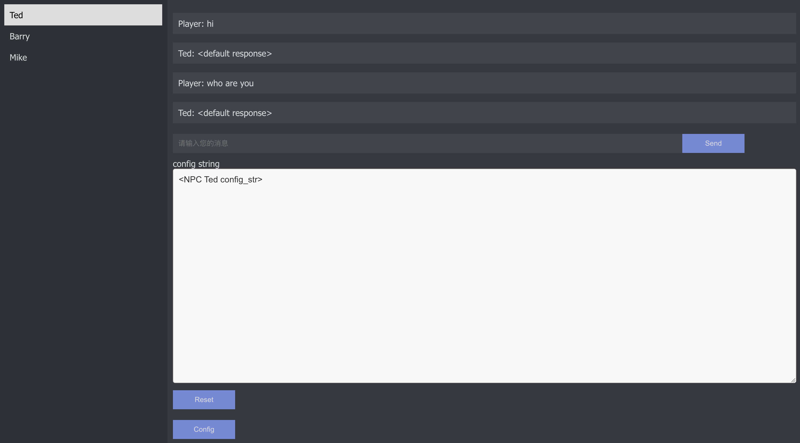

# Demo 前端简单实现

## 前端的可选方案

### 专业的选择

在选择前端框架时，需要考虑的因素有很多，包括你的个人或团队的技术背景、项目需求、期望的用户体验等。以下是一些常用的前端框架，它们都可以用来创建一个定制化的NPC对话系统：

1. **React.js**：React是由Facebook开发并维护的一个JavaScript库，主要用于构建用户界面。React的主要优点是它的组件化设计，这使得代码复用变得非常容易。此外，React还有一个非常活跃的社区，你可以在这里找到大量的教程和第三方库。

2. **Vue.js**：Vue是一个更轻量级的JavaScript框架，与React相比，Vue的学习曲线更平滑，更适合初学者。Vue也支持组件化设计，而且它的文档非常详细，使得学习和使用变得非常简单。

3. **Angular.js**：Angular是Google开发的一个全面的前端框架，它包含了开发Web应用所需的所有工具和功能。Angular的优点是它的强大和全面，但它的学习曲线相对较陡峭。

4. **Svelte**：Svelte是一个新的JavaScript框架，与React和Vue不同，Svelte在构建时进行编译，而不是运行时。这使得Svelte应用程序的性能非常好，但Svelte的社区相对较小，可能没有那么多的教程和资源可以使用。

在选择框架时，除了考虑上述因素外，还应考虑以下几点：

- **与后端的交互**：如果你的NPC对话系统需要与服务器交互，那么你需要一个能够方便地进行AJAX请求的框架。React、Vue和Angular都有相应的库或工具来支持这一点。

- **状态管理**：对话系统可能需要管理大量的状态，例如NPC的对话历史、用户的输入等。因此，选择一个有良好状态管理解决方案的框架会很有帮助。例如，React有Redux和MobX，Vue有Vuex，Angular有NgRx。

- **UI组件库**：如果你希望快速地构建用户界面，那么一个好的UI组件库会非常有帮助。例如，React有Material-UI和Ant Design，Vue有Vuetify和Element，Angular有Angular Material和NG-ZORRO。

最后，如果你对前端开发不熟悉，也可以考虑使用一些低代码或无代码的工具，如Bubble、Adalo等，这些工具可以让你在不写代码的情况下构建Web应用程序。

### 简化的选择
Gradio和类似的库也是非常好的选择，特别是对于希望快速构建和测试交互式界面的人。这些库是为了让机器学习工程师和数据科学家能更方便地分享和测试他们的模型。如果你的定制化NPC对话系统是基于机器学习的模型，那么Gradio可能会非常适合你。

**Gradio** 是一个Python库，它让你能快速地为你的模型创建一个简单的web界面，无需写任何前端代码。你只需要定义你的输入和输出接口，Gradio就会为你创建一个界面。然后你就可以通过这个界面来交互地运行你的模型，或者分享你的模型给别人。

类似的库还有：

- **Streamlit**：Streamlit是另一个非常流行的库，用于快速构建数据应用。它同样也是用Python编写的，使用起来非常简单。Streamlit有一些更复杂的组件，例如图表和表格，这使得它更适合构建数据驱动的应用。

- **Dash by Plotly**：Dash是一个用于构建分析型web应用的Python框架。它支持一系列的图表和控件，并且支持复杂的交互。Dash可能比Gradio和Streamlit更适合构建复杂的应用，但是它可能需要写更多的代码。

使用这些库的一个主要优点是，你可以集中精力在你的NPC对话系统的逻辑上，而不需要担心前端代码的编写。然而，这些库的自定义能力可能没有像React、Vue这样的前端框架那么强。如果你需要一个完全定制的界面，或者你希望使用一些特定的前端技术，那么你可能还是需要选择一个前端框架。

### 关于 Gradio 多说两句

Gradio 是一个为了方便创建模型演示和原型设计而创建的工具，它对输入和输出的类型有一定的支持，比如文本、图像、音频等，但其主要目标是简化创建交互式界面的过程，而不是提供高度的界面定制性。

对于一些基本的文本格式化，比如使用不同的字体或颜色来显示文本，或者改变文本的大小，Gradio可能并不直接支持。如果你需要对文本格式进行高度定制，可能需要使用更强大、更灵活的前端开发工具或框架，如React、Vue等，或者使用支持更多自定义选项的Python Web应用框架，如Streamlit或Dash。

然而，你仍然可以尝试在Gradio中实现一些简单的文本格式化。例如，你可以在模型的输出中包含HTML标签，然后在Gradio的界面中以HTML的形式展示这个输出。这样，你就可以使用HTML来控制文本的格式。但是，这种方法可能会有一些限制，因为Gradio可能不支持所有的HTML特性。

总的来说，如果你的需求是构建一个快速的原型或者模型演示，那么Gradio可能是一个好的选择。如果你的需求是构建一个具有高度定制性的用户界面，那么你可能需要使用一个前端开发框架或一个支持更多自定义选项的Python Web应用框架。

### 一个例子 Discord

Discord的后端主要使用Python和Flask进行REST API的构建，并且在实时系统中使用Elixir​1​。在前端方面，Discord使用了JavaScript, React, ES6, Webpack, 和 React Native等技术和工具

## 创建一个简单的NPC对话系统

### 第一步

创建一个 app.py 文件，并输入样例代码代码（如本项目中的[app.py](./app.py)）

### 第二步

安装并运行 Flask 应用

终端中运行命令

```bash
pip install flask
```

运行 Flask 应用

```bash
python app.py
```
此是 Flask 服务开始运行，开始监听本地 5000 端口
终端中会显示如下信息

```bash
 * Serving Flask app 'app'
 * Debug mode: off
WARNING: This is a development server. Do not use it in a production deployment. Use a production WSGI server instead.
 * Running on http://127.0.0.1:5000
Press CTRL+C to quit
```

### 第三步

创建 React 应用

首先，安装 create-react-app，它是一个用于创建React应用的命令行工具。在终端中运行命令

```bash
npm install -g create-react-app
```

> 如果你的系统中没有安装npm，你可以参考[这篇文章](https://www.runoob.com/nodejs/nodejs-install-setup.html)来安装npm。
> 
> 此外，在运行npm install过程中可能会报错有文件权限问题，比如：
> 
> ```bash
> npm ERR! Error: EACCES: permission denied, rename '/usr/local/lib/node_modules/create-react-app' -> '/usr/local/lib/node_modules/.create-react-app-DgI96EzL'
> ```
> 这个错误通常是由于npm没有足够的权限在文件系统中写入数据。这可能是由于以前以管理员权限（sudo）运行过npm，导致某些文件的权限被改变了。
> 
> 一个常见的解决方案是使用Node Version Manager (nvm)来管理你的Node.js版本。使用nvm可以避免权限问题，因为它会在你的用户目录下安装Node.js和npm，而不是在全局目录下。你可以在这里找到nvm的安装和使用指南：https://github.com/nvm-sh/nvm
> 
> 简化版操作为：
> ```bash
> curl -o- https://raw.githubusercontent.com/nvm-sh/nvm/v0.38.0/install.sh | bash
> ```
> 注意替换最新版本号
> 
> 此时应该可以成功运行上述命令了

然后运行以下命令创建一个新的React应用
    
```bash
npx create-react-app client
```

这会创建一个新的名为client的文件夹，其中包含了一个新的React应用的所有文件和目录。

### 第四步

- 打开 client/src/App.js 文件，删除其中的所有代码，并输入相关代码，见本范例中的[App.js](./client/src/App.js)

- 在client文件夹中，打开终端并运行以下命令安装axios，它是一个用于在浏览器和node.js中发送HTTP请求的库：
    
    ```bash
    npm install axios
    ```

### 第五步

运行 React 应用
单独打开一个终端，进入client文件夹，运行以下命令

```bash
npm start
```
React应用现在应该正在运行，并监听在localhost的3000端口。

终端中会显示如下信息

```bash
Compiled successfully!

You can now view client in the browser.

  Local:            http://localhost:3000
  On Your Network:  http://<your_IP>:3000

Note that the development build is not optimized.
To create a production build, use npm run build.

webpack compiled successfully
```

### 第六步

浏览器测试，打开浏览器，输入 http://localhost:3000/ ，即可看到聊天界面

### 第七步

开发

需要修改的文件有
- [app.py](./app.py) - 处理后端逻辑
- [client/src/App.js](./client/src/App.js) - 处理前端逻辑
- [client/src/App.css](./client/src/App.css) - 处理前端样式

## Demo 效果



基本功能包括
- 通过输入框输入对话内容
- 点击回车/发送按钮发送对话内容
- 通过点击npc列表中的npc名称，切换当前对话的npc
- npc列表中的npc名称，根据当前对话的npc，高亮显示
- 实时显示当前NPC config_str中的内容
- 用户间 session 信息隔离，同用户同浏览器 session 信息共享（基于缓存）
